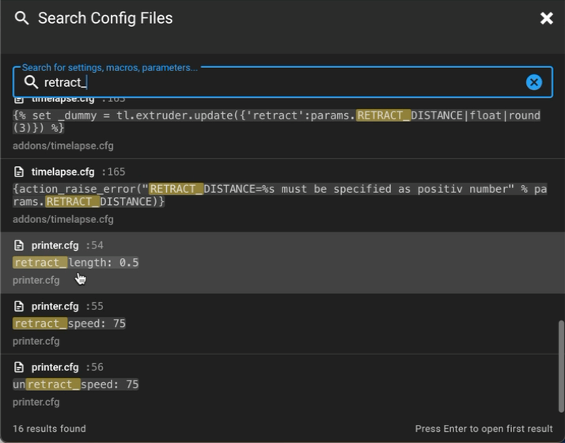

# KlipperSearch

A global configuration search feature for [Mainsail](https://github.com/mainsail-crew/mainsail), the popular web interface for [Klipper](https://www.klipper3d.org/) 3D printer firmware.

## The Problem

Klipper configurations can span multiple files - `printer.cfg`, macro files, hardware configs, and more. Finding a specific setting like `rotation_distance` or `pressure_advance` means manually opening each file and searching, which is tedious and time-consuming.

## The Solution

KlipperSearch adds a global search feature to Mainsail that:

- Searches across **all** `.cfg` and `.conf` files in your config directory
- Shows results with **filename, line number, and matching text**
- **Opens the file directly** at the matching line when you click a result
- **Caches file contents** for fast subsequent searches



## Features

- **Search Icon** in the top navigation bar
- **Keyboard Shortcut**: `Ctrl+Shift+F` (or `Cmd+Shift+F` on Mac)
- **Real-time Search**: Results appear as you type (minimum 2 characters)
- **Highlighted Matches**: Search terms are highlighted in results
- **Direct Navigation**: Click a result to open the file in the editor at that exact line
- **File Caching**: Files are cached for faster repeated searches

## Installation

See [INSTALL.md](INSTALL.md) for detailed installation instructions.

### Quick Start (Build from Source)

**On your Raspberry Pi:**

```bash
# Install Node.js 20
curl -fsSL https://deb.nodesource.com/setup_20.x | sudo bash -
sudo apt-get install -y nodejs

# Clone the repository
git clone -b develop https://github.com/mikehatch/mainsail.git
cd mainsail

# Install dependencies and build
npm ci
npm run build

# Copy to Mainsail web directory (adjust path as needed)
sudo cp -r dist/* /home/pi/mainsail/
```

### Quick Start (Pre-built)

If you have access to a pre-built version, simply copy the `dist` folder contents to your Mainsail installation directory.

## Usage

1. **Open the search dialog** by clicking the magnifying glass icon in the top bar, or press `Ctrl+Shift+F`

2. **Type your search query** (minimum 2 characters)

3. **Browse results** showing filename, line number, and matching text

4. **Click a result** to open the file in the editor at that line

## How It Works

KlipperSearch uses a client-side search approach:

1. Fetches the list of config files from Moonraker's file API
2. Downloads and caches file contents
3. Performs text search in the browser
4. Navigates to results using Mainsail's built-in editor

This approach requires no backend modifications - it works with any existing Moonraker installation.

## Architecture

```
┌─────────────────────────────────────────────────────────┐
│                      Mainsail UI                        │
│  ┌─────────────────────────────────────────────────┐   │
│  │           ConfigSearchDialog.vue                 │   │
│  │  - Search input with debouncing                  │   │
│  │  - Results list with highlighting                │   │
│  │  - Keyboard navigation                           │   │
│  └─────────────────────────────────────────────────┘   │
│                         │                               │
│  ┌─────────────────────────────────────────────────┐   │
│  │              Vuex Search Store                   │   │
│  │  - File list retrieval                          │   │
│  │  - Content fetching & caching                   │   │
│  │  - Search logic                                 │   │
│  └─────────────────────────────────────────────────┘   │
└─────────────────────────────────────────────────────────┘
                         │
                         ▼
┌─────────────────────────────────────────────────────────┐
│                    Moonraker API                        │
│  GET /server/files/list?root=config                     │
│  GET /server/files/config/{filename}                    │
└─────────────────────────────────────────────────────────┘
                         │
                         ▼
┌─────────────────────────────────────────────────────────┐
│                   Config Files                          │
│  printer.cfg, macros.cfg, hardware/*.cfg, etc.          │
└─────────────────────────────────────────────────────────┘
```

## File Structure

```
mainsail/src/
├── store/search/
│   ├── index.ts        # Store module definition
│   ├── types.ts        # TypeScript interfaces
│   ├── actions.ts      # Search logic, file fetching, caching
│   ├── mutations.ts    # State mutations
│   └── getters.ts      # Computed properties
├── components/dialogs/
│   └── ConfigSearchDialog.vue  # Search UI component
└── components/
    ├── TheTopbar.vue   # Modified - added search button
    └── TheEditor.vue   # Modified - added line navigation
```

## Development

### Prerequisites

- Node.js 20 or higher
- npm

### Setup

```bash
# Clone the fork
git clone https://github.com/mikehatch/mainsail.git
cd mainsail
git checkout develop

# Install dependencies
npm ci

# Configure for local development
cp .env.development.local.example .env.development.local
# Edit .env.development.local with your Moonraker host

# Start dev server
npm run serve
```

### Testing

For testing without a physical printer, use the [virtual-klipper-printer](https://github.com/mainsail-crew/virtual-klipper-printer) Docker project.

## Contributing

This is a fork of Mainsail with the search feature added. Contributions are welcome!

1. Fork the repository
2. Create a feature branch
3. Make your changes
4. Run `npm run lint` to check for issues
5. Submit a pull request

## License

This project inherits the [GNU General Public License v3.0](LICENSE) from Mainsail.

## Acknowledgments

- [Mainsail](https://github.com/mainsail-crew/mainsail) - The excellent Klipper web interface this builds upon
- [Moonraker](https://github.com/Arksine/moonraker) - The API server that makes this possible
- [Klipper](https://www.klipper3d.org/) - The 3D printer firmware

## Related Projects

- [mainsail-crew/mainsail](https://github.com/mainsail-crew/mainsail) - Original Mainsail project
- [Arksine/moonraker](https://github.com/Arksine/moonraker) - Moonraker API server
- [Klipper3d/klipper](https://github.com/Klipper3d/klipper) - Klipper firmware
